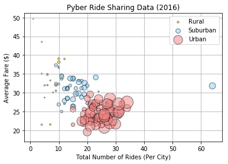
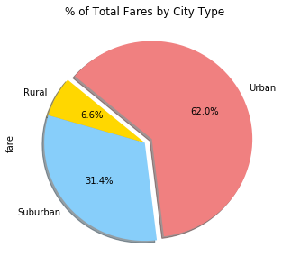
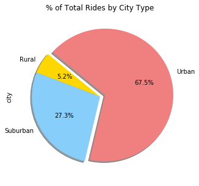
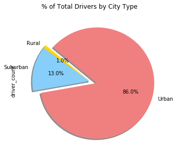

# Pyber Ride Sharing

### Analysis
-  Trend 1: There will be more people/rides in urban settings because they are more people per area. 
-  Trend 2: Average fare is pretty condensed to be about the same range in urban settings, however for rural areas, the fare costs can range a lot, most likely since locations may be further apart. 
-  Trend 3: Urban areas are the most profitable because there will be more people willing to take ride shares to get around. 


```python
# Dependencies 
import matplotlib.pyplot as plt
import numpy as np
import pandas as pd
import os

# Import the CSV files 
city_path = os.path.join("raw_data", "city_data.csv") 
ride_path = os.path.join("raw_data", "ride_data.csv") 

# Read it into pandas dataframe
city_df = pd.read_csv(city_path)
#city_df
ride_df = pd.read_csv(ride_path)
#ride_df

ride_city_merge = pd.merge(ride_df, city_df, on="city", how="left")
ride_city_merge.head()
```


<div>
<table border="1" class="dataframe">
  <thead>
    <tr style="text-align: right;">
      <th></th>
      <th>city</th>
      <th>date</th>
      <th>fare</th>
      <th>ride_id</th>
      <th>driver_count</th>
      <th>type</th>
    </tr>
  </thead>
  <tbody>
    <tr>
      <th>0</th>
      <td>Sarabury</td>
      <td>2016-01-16 13:49:27</td>
      <td>38.35</td>
      <td>5403689035038</td>
      <td>46</td>
      <td>Urban</td>
    </tr>
    <tr>
      <th>1</th>
      <td>South Roy</td>
      <td>2016-01-02 18:42:34</td>
      <td>17.49</td>
      <td>4036272335942</td>
      <td>35</td>
      <td>Urban</td>
    </tr>
    <tr>
      <th>2</th>
      <td>Wiseborough</td>
      <td>2016-01-21 17:35:29</td>
      <td>44.18</td>
      <td>3645042422587</td>
      <td>55</td>
      <td>Urban</td>
    </tr>
    <tr>
      <th>3</th>
      <td>Spencertown</td>
      <td>2016-07-31 14:53:22</td>
      <td>6.87</td>
      <td>2242596575892</td>
      <td>68</td>
      <td>Urban</td>
    </tr>
    <tr>
      <th>4</th>
      <td>Nguyenbury</td>
      <td>2016-07-09 04:42:44</td>
      <td>6.28</td>
      <td>1543057793673</td>
      <td>8</td>
      <td>Urban</td>
    </tr>
  </tbody>
</table>
</div>


## Bubble Plot of Ride Sharing Data


```python
groupby_city_and_type = ride_city_merge.groupby(["type", "city"])
#groupby_city_and_type.count()

# Find the average fare, total number of rides, and total number of drivers per city
average_fare_city_and_type = groupby_city_and_type["fare"].mean()
#average_fare_city_and_type.head()
total_rides_city_and_type = groupby_city_and_type["city"].count()
#total_rides_city_and_type.head()
total_drivers_city_and_type = groupby_city_and_type["driver_count"].sum()
#total_drivers_city_and_type

combined_df = pd.DataFrame({
    "avg_fare": average_fare_city_and_type, 
    "total_rides": total_rides_city_and_type, 
    "total_drivers": total_drivers_city_and_type
})
#combined_df.head()
combined_df["type"] = combined_df.index.map(lambda x: x[0])
combined_df["city"] = combined_df.index.map(lambda x: x[1])
#combined_df
rural_df = combined_df.loc[combined_df["type"] == "Rural"]
suburban_df = combined_df.loc[combined_df["type"] == "Suburban"]
urban_df = combined_df.loc[combined_df["type"] == "Urban"]
# print(rural_df)
# print(suburban_df)
# print(urban_df)
```


```python
# Specify the x-axis, y-axis, and size values for each city type 
rural_x = rural_df["total_rides"]
rural_y = rural_df["avg_fare"]
rural_size = rural_df["total_drivers"] / 5

suburban_x = suburban_df["total_rides"]
suburban_y = suburban_df["avg_fare"]
suburban_size = suburban_df["total_drivers"] / 5

urban_x = urban_df["total_rides"] 
urban_y = urban_df["avg_fare"] 
urban_size = urban_df["total_drivers"] / 5

# Plot 3 separate scatterplots for each city type 
rural_handle = plt.scatter(rural_x, rural_y, marker="o", facecolors="gold", edgecolors="black", s=rural_size, alpha=0.5, label="Rural")
suburban_handle = plt.scatter(suburban_x, suburban_y, marker="o", facecolors="lightskyblue", edgecolors="black", s=suburban_size, alpha=0.5, label="Suburban")
urban_handle = plt.scatter(urban_x, urban_y, marker="o", facecolors="lightcoral", edgecolors="black", s=urban_size, alpha=0.5, label="Urban")

# Create a legend for the scatterplots 
plt.legend(handles=[rural_handle, suburban_handle, urban_handle], loc="best")

plt.title("Pyber Ride Sharing Data (2016)")
plt.xlabel("Total Number of Rides (Per City)")
plt.ylabel("Average Fare ($)")
#plt.xlim(0, max(combined_df["total_rides"]) + 5) 
#plt.ylim(0, max(combined_df["avg_fare"]) + 5)
plt.grid()

plt.show()
```





## Total Fares by City Type


```python
# Groupby City Type first
groupby_type = ride_city_merge.groupby("type") 

# Find the total fare cost for all cities 
total_fares_all = ride_city_merge["fare"].sum()

# Find the total fares by city type, then the percentage 
total_fares_city_type = groupby_type["fare"].sum()
total_fares_percent = total_fares_city_type / total_fares_all * 100
#total_fares_percent
```


```python
explode = (0, 0, 0.08)
colors = ["gold", "lightskyblue", "lightcoral"]

total_fares_percent.plot(kind="pie", explode=explode, colors=colors, autopct="%1.1f%%", shadow=True, startangle=140, figsize=(5, 5))

plt.title("% of Total Fares by City Type")
plt.show()
```





## Total Rides by City Type


```python
# Find the total rides for all cities 
total_rides_all = len(ride_city_merge)
#total_rides_all = groupby_type["city"].count().sum()
#total_rides_all

# Find the count for total rides by city type, then percentage 
total_rides_city_type = groupby_type["city"].count()
total_rides_percent = total_rides_city_type / total_rides_all * 100
#total_rides_percent
```


```python
explode = (0, 0, 0.08)
colors = ["gold", "lightskyblue", "lightcoral"]

total_rides_percent.plot(kind="pie", explode=explode, colors=colors, autopct="%1.1f%%", shadow=True, startangle=140, figsize=(5, 5))

plt.title("% of Total Rides by City Type")
plt.show()
```





## Total Drivers by City Type


```python
# Find the total drivers for all cities 
total_drivers_all = ride_city_merge["driver_count"].sum()
#total_drivers_all = groupby_type["driver_count"].sum().sum()
#total_drivers_all

# Find the total drivers by city type, then the percentage 
total_drivers_city_type = groupby_type["driver_count"].sum()
total_drivers_percent = total_drivers_city_type / total_drivers_all * 100
#total_drivers_percent
```


```python
explode = (0, 0, 0.14)
colors = ["gold", "lightskyblue", "lightcoral"]

total_drivers_percent.plot(kind="pie", explode=explode, colors=colors, autopct="%1.1f%%", shadow=True, startangle=140, figsize=(5, 5))

plt.title("% of Total Drivers by City Type")
plt.show()
```


